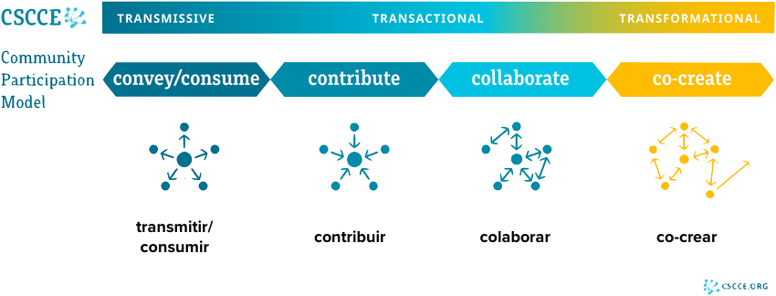
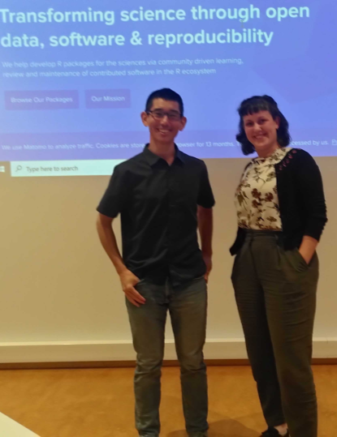

## Agenda para hoy

* ¿Qué es una contribución para un proyecto de código abierto?
* ...¿y para una comunidad?
* Ejemplos con rOpenSci
* ¿Cómo puedo ayudar a las personas a contribuir a mi paquete?

## Contribuciones {.winter}

Cuando escuchas "Hice una **contribución** a un proyecto o comunidad de código abierto"...

...¿qué te viene a la mente?

# Desde la perspectiva de una comunidad

Tenemos algunos modelos de participación

## Comunidad de Practica

> Grupo de personas que **comparten una
pasión** por algo que saben **como hacer**, y que **interactúan regularmente** con el objetivo de **aprender como hacerlo mejor** – *Etienne Wenger*

# ¿Cómo alguien llega a formar parte de una comunidad?

## Camino hacia la Inclusión

#### Seis pasos desde "nunca escuché de esto" hasta "esto es lo mío"

::: {.incremental}

* **Conciencia**: Escuché hablar de esto. 
* **Comprensión**: Entiendo qué es y cómo sería involucrarme.
* **Identificación**: me imagino haciendo esto. 
* **Acceso**: Puedo hacer esto (física, logística, financiera, ...) 
* **Pertenencia**: Siento que encajo.
* **Apropiación**: Me importa tanto como para asumir la responsabilidad.

:::

::: footer
[Pathway To Inclusion por Alex Bayley](https://www.harihareswara.net/posts/2022/the-pathway-to-inclusion-insight-from-alex-bayley/) y 
[We R Together. How to learn, use and improve a programming language as a community](https://yabellini.netlify.app/talk/2025_user2025/)
:::

## Camino hacia la Inclusión

#### Seis pasos desde "nunca escuché de esto" hasta "esto es lo mío"

::: {.incremental}

* **Conciencia**: redes sociales, conferencias, meetups. 
* **Comprensión**: README, documentación, sitio web
* **Identificación**: [casos de uso](https://ropensci.org/es/usecases/), [entrevistas](https://ropensci.org/es/blog/2023/11/06/r-universe-stars-finale-es/), experiencias 
* **Acceso**: codigo de conducta, zonas horarias 
* **Pertenencia**: idiomas
* **Apropiación**: onboarding, [issues etiquetados](https://ropensci.org/es/help-wanted/), guías de contribución

:::

## Camino hacia la Inclusión {.winter}

::: {.incremental}

* ¿Cuáles son tus comunidades de práctica relacionadas con R?

* ¿Qué actividad o herramienta te ayudó a integrarte en tu comunidad?

* ¿Puedes dar ejemplos de otras comunidades o proyectos de los que formas parte y en qué etapa te encuentras?

* ¿Cuánto tiempo te tomó pasar de un estado a otro?

:::

::: footer
[Pathway To Inclusion por Alex Bayley](https://www.harihareswara.net/posts/2022/the-pathway-to-inclusion-insight-from-alex-bayley/) y 
[We R Together. How to learn, use and improve a programming language as a community](https://yabellini.netlify.app/talk/2025_user2025/)
:::

# ¿Cómo alguien participa en una comunidad?

## Modelo de Participación Comunitaria CSCCE

::: footer
[Modelo de Participación Comunitaria CSCCE](https://www.cscce.org/resources/cpm/) 
:::

## Ejemplo {.smaller}

:::: {.columns}

::: {.column width="60%"}
::: {.incremental}
**Joel** tenía previsto visitar Oslo, Noruega, para dar un taller. 

Se puso en contacto con **Mo**, otra *persona activa de rOpenSci*, para proponerle tomar un café, 

y Mo le preguntó si estaría dispuesto a *dar otro taller*. 

Mo había *visto* a Joel en una *"conversaciones con la comunidad" de rOpenSci sobre {targets}* y quería *aprovechar su experiencia* para empezar a profundizar en el tema. 

Joel se dio cuenta de que esa era *la motivación* que necesitaba para *actualizar los materiales del taller*, así que aceptó encantado.

:::
:::

::: {.column width="40%"}

:::

::::

::: footer
[Teaching Targets With Penguins](https://ropensci.org/blog/2023/07/20/teaching-targets-with-penguins/)
:::

## Ejemplo

- *Community Call*: Joel estaba **contribuyendo** y Mo estaba en **consumo**
- *Blog Post*: Joel y Mo estaban **colaborando** 
- *Workshop*: Joel y Mo estaban **co-creando**

Colaboración con otras organizaciones y comunidades.

## Modelo de Participación Comunitaria CSCCE {.winter}

* ¿Cuál es tu forma más habitual de participar en tu comunidad?

* ¿Dónde ubicarías el Programa de Campeones?

## Modelo de Participación Comunitaria CSCCE

Los programas de campeones suelen estar en todo el espectro

Ejemplos de actividades de campeones

::: {.incremental}

* **Transmitir**: publican en redes sociales para difundir más ampliamente

* **Contribuir**: invitan a otros a asistir a un evento;

* **Colaborar**: organizan una llamada comunitaria;

* **Co-crear**: realizan capacitaciones u otras actividades para otros en la comunidad

:::

::: footer
[Modelo de Participación Comunitaria CSCCE](https://www.cscce.org/resources/cpm/) 
:::

## Ejemplos de rOpenSci

::: {.incremental}

* [Guía de Contribución de la Comunidad rOpenSci](https://contributing.ropensci.org): guía para ayudar a las personas a encontrar formas de participar en rOpenSci

* [Guía del Blog de rOpenSci](https://blogguide.ropensci.org): una guía para ayudar a las personas a escribir y editar para el Blog de rOpenSci.

* [Paquetes rOpenSci: Desarrollo, Mantenimiento y Revisión por Pares](https://devguide.ropensci.org): guía para personas que desarrollan y revisan en el sistema de revisión por pares de software de rOpenSci

* [Guía de localización y traducción de rOpenSci](https://translationguide.ropensci.org/es/index.es.html): Cómo y porqué traducimos y localizamos nuestros recursos.

:::

## Ejemplos de rOpenSci {.winter}

::: {.incremental}

* ¿Has participado en alguna de estas opciones?

* ¿Cuál te gustaría probar?

* ¿Cuál te parece más accesible o útil para tus grupos de trabajo u otras comunidades?

* Puedes usar muchas de estas opciones como tu actividad de difusión para el Programa de Campeones.

* Nos gustaría aprender cómo podemos mejorar estas actividades. Difunde información sobre estas opciones a personas en tus comunidades.

::: 

# ¿Cómo son útiles estos conceptos para mi paquete?

## Transmitir

::: {.incremental}

* Crea un [README](https://blog.r-hub.io/2019/12/03/readmes/) completo: explica claramente qué hace tu paquete, cómo instalarlo y cómo los usuarios pueden empezar a usarlo. Incluye ejemplos o casos de uso y (enlaces a) cualquier información relevante que pueda ayudar a los usuarios a entender cómo tu paquete puede ayudarles.

* [Fija el repositorio de tu paquete a tu perfil](https://docs.github.com/en/account-and-profile/setting-up-and-managing-your-github-profile/customizing-your-profile/pinning-items-to-your-profile) para que otras personas puedan encontrarlo rápidamente.

* [Crea un universo en R-universe](https://ropensci.org/blog/2021/06/22/setup-runiverse/), simplifica la instalación de tu paquete y proporciona estadísticas e información útiles sobre él.

:::

## Transmitir

::: {.incremental}

* Recomendamos crear un **sitio web de documentación** para tu paquete usando pkgdown. 

* Aprovecha plataformas como Mastodon, LinkedIn y foros específicos de R como [R-bloggers](https://www.r-bloggers.com/) y [R Weekly](https://rweekly.org/) para anunciar el lanzamiento de tu paquete.

* Si te gusta dar charlas, puedes presentar en un Grupo de Usuarios de R o [Capítulo de R-Ladies](https://www.meetup.com/pro/rladies/).

* Presentar tu paquete en una **conferencia específica del dominio** o en conferencias específicas de R (LatinR ;-)).

* Si tu paquete encaja en una [Vista de Tareas de CRAN](https://cran.r-project.org/web/views/) puedes proponer su adición.

:::

## Contribuir / Colaborar

Haz que tu repositorio sea amigable para la contribución y colaboración

::: {.incremental}

* Código de conducta (`CODE_OF_CONDUCT.md`): puedes insertar uno con `use_code_of_conduct()` del paquete `usethis`. La plantilla proviene de https://www.contributor-covenant.org.

* Licencia OSI (`LICENSE.md`).

* Guía de contribución (`CONTRIBUTING.md`): una forma fácil de insertar una plantilla para una guía de contribución es `use_tidy_contributing()` del paquete `usethis`.

:::

## Contribuir / Colaborar {.winter}

En grupos usa tu paquete o el paquete que creamos en las otras capacitaciones y 

* agrega un Código de Conducta.

* agrega una Guía de Contribución.

Ayuda de {usethis}: https://usethis.r-lib.org/reference/use_code_of_conduct.html

## Guía de contribución

Las preferencias personales en una guía de contribución incluyen:

::: {.incremental}

* ¿Preferencias de estilo? 

* ¿Infraestructura como roxygen2?

* ¿Preferencias de flujo de trabajo? ¿Issue antes de un PR?

* Describe cómo reconoces las contribuciones. 

* ¿Una declaración de alcance, como en el paquete [skimr](https://github.com/ropensci/skimr/blob/main/.github/CONTRIBUTING.md#understanding-the-scope-of-skimr)?

* Recomendamos que las guías de contribución incluyan una [declaración de ciclo de vida que aclare visiones y expectativas](https://github.com/ecohealthalliance/fasterize/blob/main/CONTRIBUTING.md#roadmap) para el desarrollo futuro de tu paquete.

:::

## Gestión de issues

::: {.incremental}

*  [Plantilla(s) de issue](https://docs.github.com/en/communities/using-templates-to-encourage-useful-issues-and-pull-requests/configuring-issue-templates-for-your-repository#creating-issue-templates): ayudan a los usuarios a completar mejores reportes de errores o solicitudes de funcionalidades.

* [Etiquetado de issues](https://help.github.com/articles/helping-new-contributors-find-your-project-with-labels/): usa etiquetas como "help wanted" y "good first issue" para ayudar a colaboradores potenciales, incluyendo principiantes, a encontrar tu repositorio. 

* [Fijar issues](https://docs.github.com/en/articles/pinning-an-issue-to-your-repository): Puedes fijar hasta 3 issues por repositorio que luego aparecerán en la parte superior de tu rastreador de issues como tarjetas de issue atractivas. Puede ayudar a publicitar cuáles son tus prioridades.

:::

## Recursos adicionales: Colaborar / Co-crear.

::: {.incremental}

* Sección de la Guía de Desarrollo sobre [Trabajar con colaboradores](https://devguide.ropensci.org/es/maintenance_collaboration.es.html#workingcollaborators)

* Publicación del blog [Ideas de Marketing para tu Paquete](https://ropensci.org/es/blog/2024/03/07/package-marketing/)

* Llamada comunitaria de rOpenSci [Configura tu Paquete para Fomentar una Comunidad](https://ropensci.org/commcalls/apr2021-pkg-community/).

* Para reutilizar respuestas amables y habituales, considera las [respuestas guardadas](https://docs.github.com/en/github/writing-on-github/working-with-saved-replies/using-saved-replies) de GitHub.

:::

# ¡Tiempo para Comentarios y Preguntas! :-)
